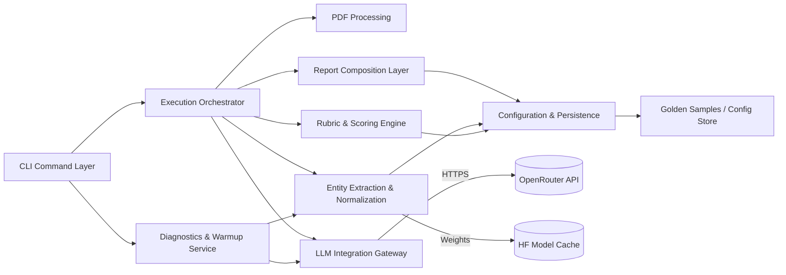
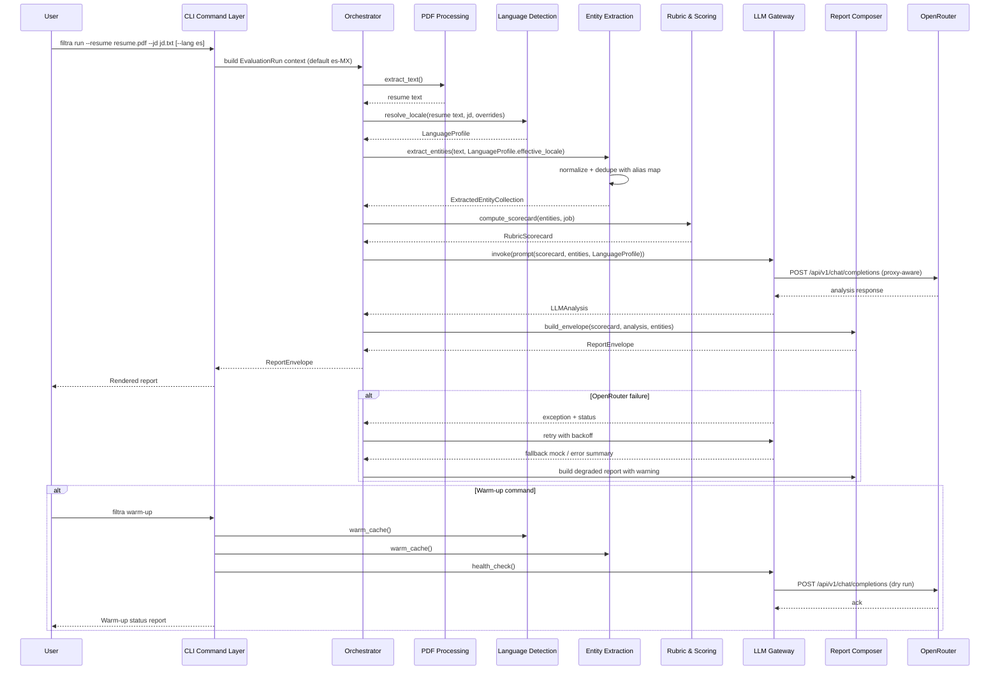

# FILTRA Architecture Document

## Introduction

This document outlines the overall project architecture for FILTRA, including backend systems, shared services, and non-UI specific concerns. Its primary goal is to serve as the guiding architectural blueprint for AI-driven development, ensuring consistency and adherence to chosen patterns and technologies.

**Relationship to Frontend Architecture:**
If the project includes a significant user interface, a separate Frontend Architecture Document will detail the frontend-specific design and MUST be used in conjunction with this document. Core technology stack choices documented herein (see "Tech Stack") are definitive for the entire project, including any frontend components.
### Starter Template or Existing Project

No starter template or existing scaffold is referenced in the PRD. Treat FILTRA as a greenfield backend build and prepare to assemble tooling manually unless we later adopt a minimal Poetry-based CLI skeleton for faster lint/test bootstrap.

### Change Log

| Date       | Version | Description                         | Author   |
|------------|---------|-------------------------------------|----------|
| 2025-09-26 | 0.1     | Initial architecture draft (in progress) | Winston |
## High Level Architecture

### Technical Summary
FILTRA is a single-process Python CLI monolith that orchestrates PDF parsing, entity extraction, rubric-driven scoring, and OpenRouter LLM analysis within one codebase. A command dispatcher coordinates flows between modules handling resume ingestion, multilingual NER via HuggingFace pipelines, rubric-weighted scoring, and report rendering. The CLI persists no user data, instead streaming artifacts through in-memory structures and one-off temp storage that is cleared after execution. External dependencies are limited to OpenRouter’s HTTP API, local HuggingFace model weights, and optional warming routines. This layout satisfies PRD goals of a quickly demoable Windows-friendly tool that showcases both local NER and remote LLM integration. The experience defaults to Spanish ( `es-MX`) responses for Mexican recruiters while preserving English support through detection and overrides. 

### High Level Overview
- **Architecture style:** Monolithic CLI with modular subsystems for parsing, extraction, scoring, reporting, augmented by optional warm-up subcommand.
- **Repository structure:** Monorepo (single Python project) aligned with PRD mandate for MVP simplicity.
- **Service architecture:** Self-contained CLI executable; externalized capabilities limited to OpenRouter API calls and local HF pipeline invocations without microservices.
- **Primary flow:** User invokes CLI (--resume PDF + --jd text) → input validator normalizes CLI arguments and resolves locale preferences (default s-MX, override via --lang, or automatic detection from resume/JD) → resume text is extracted and preprocessed → language profiler finalizes prompt/report locale → NER module loads multilingual model, extracts entities, runs normalization/dedup → scoring orchestrator loads rubric YAML, merges NER findings and JD to assemble LLM prompt and compute rubric-driven sub-scores → OpenRouter client calls configured model → response synthesizer merges deterministic rubric results with LLM insights → report renderer prints terminal-friendly summary respecting --quiet, --wide, and localization options → process exits with status per success/failure.
- **Key decisions:** Keep everything in-process to minimize Windows packaging overhead; prefer synchronous API calls with timeouts and retries per reliability epic; rely on configuration files (`config/rubric.yaml`, CLI flags) for deterministic scoring; isolate external interactions behind adapters so offline mocks satisfy FR15.

### High Level Project Diagram
```mermaid
graph TD
    User[Recruiter CLI Invocation] -->|CLI args| CLIEntry[CLI Entry & Arg Parser]
    CLIEntry --> Warmup{Subcommand?}
    Warmup -->|Prefetch| ModelCache[HF Model Cache]
    Warmup -->|Ping| OpenRouterAPI
    CLIEntry -->|Main run| Orchestrator
    Orchestrator -->|Extract text| PDFParser[PDF Text Extractor]
    Orchestrator -->|Entities| NERPipeline[HuggingFace NER Pipeline]
    Orchestrator -->|Rubric load| RubricLoader[Rubric Config (YAML)]
    Orchestrator -->|Prompt+score| LLMClient[OpenRouter LLM API]
    LLMClient --> OpenRouterAPI[(OpenRouter)]
    NERPipeline --> ModelCache
    Orchestrator -->|Normalize & merge| ScoreEngine[Scoring & Normalization]
    ScoreEngine --> ReportBuilder[Report Composer]
    ReportBuilder --> CLIOutput[Terminal Renderer]
    CLIOutput --> User
```

### Architectural and Design Patterns
- **Layered Modular Monolith:** CLI entrypoint dispatches to domain-focused modules (ingestion, extraction, scoring, reporting) while sharing a common configuration core. _Rationale:_ Keeps implementation simple for MVP, supports Windows distribution, and avoids premature service boundaries while still promoting testable separations.
- **Adapter/Gateway Pattern for External Services:** OpenRouter interactions and NER model loading are wrapped in dedicated clients exposing interface contracts. _Rationale:_ Enables FR15 graceful degradation (mock responses, offline fallbacks) and simplifies dependency injection for unit tests.
- **Pipes & Filters Processing Pipeline:** Resume data flows through a deterministic pipeline (parse → extract → normalize → score → render) where each stage outputs enriched artifacts to the next. _Rationale:_ Aligns with FR13 normalization requirements, facilitates insertion of retries/metrics, and supports optional warm-up and quiet modes without entangling core logic.
- **Configuration-Driven Strategy Pattern:** Scoring behavior and prompt variants are selected via CLI flags/config files, allowing replacement of NER models or LLM prompts without code changes. _Rationale:_ Satisfies FR14/FR18 customization flags and supports experimentation under tight timelines.
## Tech Stack

### Cloud Infrastructure
- **Provider:** Local execution (developer machine) plus OpenRouter API
- **Key Services:** Local filesystem, HuggingFace cache directory, OpenRouter HTTPS endpoint
- **Deployment Regions:** N/A (client-side tool)

### Technology Stack Table
| Category                | Technology                               | Version   | Purpose                                        | Rationale                                                                 |
|-------------------------|-------------------------------------------|-----------|------------------------------------------------|---------------------------------------------------------------------------|
| Language                | Python                                    | 3.10.11   | Primary runtime                                | Matches PRD Windows requirement; default locale tuned for Spanish users  |
| Package Management      | pip-tools + venv                          | 7.4.1     | Pin dependencies / generate requirements files | Automates lock files while honouring requirements.txt mandate            |
| CLI Framework           | typer                                     | 0.12.3    | Build commands, subcommands, PowerShell help   | Modern API, auto completion, clean help output                           |
| Argument Parsing        | typer/click (transitive)                  | 8.1.7     | Underlying CLI parsing                         | Provided via typer dependency                                            |
| PDF Extraction          | pypdf                                     | 5.1.0     | Parse resume PDFs                              | Pure Python, Windows-friendly                                            |
| Language Detection      | langdetect                                | 1.0.9     | Auto-detect resume/JD language                 | Lightweight, works offline; bias configurable to prefer Spanish          |
| NER Pipeline            | transformers + Davlan/bert-base-multilingual-cased-ner-hrl | 4.44.0 | Multilingual entity extraction                 | CPU-only support, covers ES/EN per PRD                                   |
| Alt NER (EN fallback)   | transformers + dslim/bert-base-NER        | 4.44.0    | EN-only fallback                               | Lightweight alternative if multilingual weights unavailable              |
| Tokenizer Backend       | tokenizers                                | 0.19.1    | Support HF pipelines                           | Required for transformers pipelines                                      |
| HTTP Client             | httpx                                     | 0.27.0    | OpenRouter communication                       | Built-in retries/timeouts; respects proxy env vars                       |
| Proxy Configuration     | Built-in environment variables            | n/a       | Honour HTTPS_PROXY/HTTP_PROXY/NO_PROXY         | Satisfies NFR17 corporate network constraints                            |
| Retries/Backoff         | tenacity                                  | 9.0.0     | Resilient API calls                            | Simplifies retry policies demanded by reliability epic                   |
| Config Management       | PyYAML                                    | 6.0.1     | Load rubric/config files                       | Simple YAML parsing                                                      |
| Config Validation       | pydantic                                  | 2.8.2     | Validate rubric & CLI config                   | Strict types, good error messages                                        |
| Report Rendering        | rich                                      | 13.7.1    | Terminal-friendly report, width handling       | Handles `--wide`, tables, quiet toggles                                  |
| Logging                 | logging + rich.logging                    | builtin   | Structured logs respecting `--quiet`           | Meets PRD logging requirement                                            |
| Testing Framework       | pytest                                    | 8.3.2     | Unit & integration tests                       | Widely used, plugin ecosystem                                            |
| Test Utilities          | pytest-mock                               | 3.14.0    | Mocking external services                      | Streamlines adapter tests                                                |
| Coverage                | coverage                                  | 7.5.4     | Coverage reporting                             | Ensures quality metrics                                                  |
| Linting                 | ruff                                      | 0.6.5     | Lint + import sorting                          | Fast, single tool for lint + style                                       |
| Formatting              | black                                     | 24.8.0    | Code formatting                                | Widely adopted, deterministic output                                    |
| Type Checking           | mypy                                      | 1.10.0    | Static type analysis                           | Improves reliability of adapters                                         |
| Packaging Script        | python -m piptools compile                | n/a       | Generate pinned requirements                   | Documented for Windows compatibility                                     |
| Golden Sample Storage   | samples/ directory                        | n/a       | Store FR12 sample inputs                       | Simplifies test fixtures                                                 |
| Model Cache Location    | %LOCALAPPDATA%/filtra/models              | n/a       | Persist HF weights between runs                | Windows-appropriate default                                              |\n## Data Models

#### ResumeDocument
**Purpose:** Represents the candidate resume input, capturing both the original PDF metadata and the extracted plain text used downstream.

**Key Attributes:**
- source_path: Path - Absolute/relative filesystem path to the PDF provided via `--resume`.
- extracted_text: str - Normalized plain-text body produced by the PDF parser, ready for NER and scoring.

**Relationships:**
- Supplies text to ExtractedEntityCollection for multilingual NER processing.
- Linked to EvaluationRun as the primary user-provided artifact.
#### JobDescription
**Purpose:** Stores the target role description text and metadata that guide compatibility scoring and prompt construction.

**Key Attributes:**
- source_path: Path - Filesystem location of the text file provided via `--jd`.
- normalized_text: str - Cleaned job description content used for NER comparison and LLM prompting.

**Relationships:**
- Coupled with EvaluationRun to provide context for scoring and reporting.
- Cross-referenced by RubricConfig to weight criteria based on job expectations.
#### LanguageProfile
**Purpose:** Captures detected and user-specified language preferences to drive prompt localization and reporting outputs.

**Key Attributes:**
- default_locale: str - Project default (`es-MX`) applied when no overrides are provided.
- resume_locale: Optional[str] - Auto-detected language code from resume content.
- jd_locale: Optional[str] - Auto-detected language code from job description text.
- effective_locale: str - Final locale used for prompts and rendered report sections.

**Relationships:**
- Managed within EvaluationRun; referenced by PromptTemplateAssembler and ReportRenderer.
- Ingests signals from Language Detection & Localization component and exposes them to downstream modules.
#### ExtractedEntityCollection
**Purpose:** Aggregates structured entities (skills, companies, education, languages) produced by the multilingual NER pipeline after normalization/deduplication.

**Key Attributes:**
- entities: List[Entity] - Entity objects with type, canonical name, aliases, and confidence score.
- normalization_log: List[str] - Trace of transformations (casefolding, alias mapping) applied for FR13 auditability.

**Relationships:**
- Consumes text from ResumeDocument; feeds normalized data into RubricScorecard and report generation.
- Uses AliasMap to resolve synonyms and apply deduplication rules.
#### AliasMap
**Purpose:** Maintains curated alias mappings and language-agnostic normalization rules applied to extracted entities.

**Key Attributes:**
- alias_rules: Dict[str, List[str]] - Canonical term to alias list mapping, versioned for audit.
- locale_overrides: Dict[str, Dict[str, str]] - Optional per-language overrides when ES/EN nuances differ.

**Relationships:**
- Referenced by ExtractedEntityCollection during normalization workflows.
- Loaded from configuration files managed by RubricConfig to ensure reproducible scoring.
#### RubricConfig
**Purpose:** Encapsulates the compatibility scoring rubric, weighting criteria and threshold rules used to compute deterministic sub-scores.

**Key Attributes:**
- weights: Dict[str, float] - Weight assignments per scoring dimension (skills match, experience, language fit, etc.).
- thresholds: Dict[str, Any] - Cutoff values or normalization parameters (e.g., minimum skill overlap percentages).

**Relationships:**
- Loaded from `config/rubric.yaml` and versioned for FR11/FR12 traceability.
- Consumed by RubricScorecard during score computation; referenced by PromptTemplateAssembler to align LLM prompts with rubric focus.
#### RubricScorecard
**Purpose:** Stores computed rubric sub-scores, intermediate metrics, and final compatibility score before report rendering.

**Key Attributes:**
- sub_scores: Dict[str, float] - Weighted results per criterion (e.g., skills_match, experience_alignment).
- overall_score: float - Aggregated 0-100 score respecting weight totals.

**Relationships:**
- Receives weights/thresholds from RubricConfig and normalized entities from ExtractedEntityCollection.
- Supplies deterministic metrics to ReportEnvelope and to the LLM prompt for context.
#### EvaluationRun
**Purpose:** Represents a single CLI execution, bundling inputs, configuration choices, processing metadata, and outputs for auditing and golden sample comparisons.

**Key Attributes:**
- run_id: str - UUID or timestamp-based identifier for traceability.
- cli_options: Dict[str, Any] - Flags provided (models, quiet, lang, seed) captured for reproducibility.

**Relationships:**
- Aggregates ResumeDocument, JobDescription, and LanguageProfile artifacts and references the RubricConfig snapshot.
- Produces RubricScorecard and ReportEnvelope; linked to WarmupResult when preflight checks precede execution and exposes effective locale to downstream renderers.
#### ReportEnvelope
**Purpose:** Encapsulates the structured report presented to the recruiter, merging deterministic rubric scores and LLM narrative output.

**Key Attributes:**
- summary_sections: List[ReportSection] - Ordered blocks (overview, strengths, gaps, entity highlights) ready for terminal rendering.
- render_options: Dict[str, Any] - Flags influencing layout (`wide`, `quiet`, localization).

**Relationships:**
- Receives RubricScorecard data, LLMAnalysis artifacts, and the effective locale from LanguageProfile; passed to ReportRenderer for CLI display.
- Stored alongside EvaluationRun for FR12 golden sample comparisons.
## Components

### CLI Command Layer
**Responsibility:** Typer-based command surface exposing `run` and `warm-up` subcommands, parsing CLI flags, validating inputs, and handing off execution.

**Key Interfaces:**
- `run(resume_path, jd_path, **options)`
- `warm_up(**options)`

**Dependencies:** Execution Orchestrator; Diagnostics & Warmup Service; Configuration & Persistence.

**Technology Stack:** `typer` 0.12.3 on top of `click` 8.1.7 with stdlib logging.

### Execution Orchestrator
**Responsibility:** Central controller for end-to-end processing—stitches together parsing, extraction, scoring, LLM call, and reporting within a deterministic pipeline.

**Key Interfaces:**
- `execute(run_context: EvaluationRun) -> ReportEnvelope`
- `handle_failure(error) -> int`

**Dependencies:** PDF Processing; Language Detection & Localization; Entity Extraction & Normalization; Rubric & Scoring Engine; LLM Integration Gateway; Report Composition Layer; Diagnostics hooks.

**Technology Stack:** Python service class with dependency injection, `tenacity` for retries, structured logging adapters.

### PDF Processing Module
**Responsibility:** Safely extract, clean, and normalize text from resume PDFs while logging recoverable parsing issues.

**Key Interfaces:**
- `extract_text(resume_path) -> str`
- `inspect_metadata(resume_path) -> Dict[str, Any]`

**Dependencies:** `pypdf`; logging; configuration for language detection hints.

**Technology Stack:** Functional wrapper around `pypdf` 5.1.0 with heuristics for malformed PDFs.

### Language Detection & Localization
**Responsibility:** Resolve the effective locale for prompts and report sections using defaults (`es-MX`), CLI overrides, and automatic detection from resume/JD content.

**Key Interfaces:**
- `detect(profile_inputs) -> LanguageProfile`
- `enforce_override(lang_code, profile) -> LanguageProfile`

**Dependencies:** `langdetect`; configuration defaults; access to ResumeDocument/JobDescription text; logging.

**Technology Stack:** langdetect tuned to prioritize Spanish confidence; fallback heuristics when detection is ambiguous; integrates with `utils/language.py` helpers.
### Entity Extraction & Normalization Module
**Responsibility:** Run HuggingFace NER pipeline, normalize/deduplicate entities per FR13, and persist transformation logs.

**Key Interfaces:**
- `extract_entities(text, lang) -> ExtractedEntityCollection`
- `warm_cache(model_id)`

**Dependencies:** `transformers`, `tokenizers`, AliasMap, CPU-optimized settings.

**Technology Stack:** Transformers pipeline with thread-safe model loading, locale-aware alias application.

### Rubric & Scoring Engine
**Responsibility:** Apply rubric weights/thresholds to normalized entities and job description context to compute deterministic sub-scores and totals.

**Key Interfaces:**
- `compute_scorecard(entities, job_desc, rubric) -> RubricScorecard`
- `explain(scorecard) -> Dict[str, str]`

**Dependencies:** RubricConfig; job description utilities; statistics helpers.

**Technology Stack:** Pydantic-backed config objects, numeric operations via Python `decimal`.

### LLM Integration Gateway
**Responsibility:** Encapsulate OpenRouter HTTP calls, request shaping, retries, and fallbacks/mock responses for offline mode.

**Key Interfaces:**
- `invoke(prompt, params) -> LLMAnalysis`
- `health_check() -> WarmupCheckResult`

**Dependencies:** `httpx`, `tenacity`, environment loader for `OPENROUTER_API_KEY`.

**Technology Stack:** Async-capable `httpx` client used synchronously; structured timeout/retry policies.

### Report Composition Layer
**Responsibility:** Merge rubric metrics, LLM insights, and extracted entities into terminal-ready sections respecting `--wide`, `--quiet`, and localization flags.

**Key Interfaces:**
- `build_envelope(scorecard, llm_analysis, entities) -> ReportEnvelope`
- `render(envelope, stream) -> None`

**Dependencies:** `rich`; localization helpers; text wrapping utilities.

**Technology Stack:** Rich console with fallback plain formatter for quiet mode.

### Diagnostics & Warmup Service
**Responsibility:** Execute optional warm-up command: prefetch models, verify API connectivity, report readiness status before demos.

**Key Interfaces:**
- `run_checks(options) -> WarmupResult`
- `summarize(result) -> str`

**Dependencies:** Language Detection & Localization; Entity Extraction module; LLM gateway; filesystem for cache; logging.

**Technology Stack:** Shared service invoked via Typer subcommand with `rich` progress.

### Configuration & Persistence Layer
**Responsibility:** Load rubric/alias configs, manage model cache paths, persist golden samples and run metadata for FR12 verification.

**Key Interfaces:**
- `load_rubric(version) -> RubricConfig`
- `load_alias_map() -> AliasMap`
- `persist_run(run: EvaluationRun)`

**Dependencies:** `PyYAML`; filesystem; Pydantic models.

**Technology Stack:** Config readers/writers with Windows-aware paths.

### Component Diagram

## External APIs

### OpenRouter API
- **Purpose:** Obtain LLM-powered scoring narrative and qualitative analysis.
- **Documentation:** https://openrouter.ai
- **Base URL(s):** https://openrouter.ai/api/v1
- **Authentication:** Bearer token via `Authorization: Bearer ${OPENROUTER_API_KEY}` with required `HTTP-Referer` and `X-Title` headers.
- **Rate Limits:** Default ~60 req/min depending on plan; client enforces exponential backoff via `tenacity`.

**Key Endpoints Used:**
- `POST /api/v1/chat/completions` - Submit combined resume/JD prompt and receive analysis payload.

**Integration Notes:** Deterministic parameters (`temperature`, `seed`, `model`) controlled by CLI options; degrade gracefully with cached/mock responses on failures; log minimal metadata to honor privacy constraints; warm-up command performs dry-run request to verify connectivity.

_Only external API integration required; HuggingFace models are cached locally via transformers._
## Core Workflows


## REST API Spec
_Not applicable: FILTRA is a CLI tool and does not expose REST endpoints. External interactions are covered under OpenRouter API integration._


## Database Schema

FILTRA operates entirely in-memory; no persistent database is required. Runtime artifacts (EvaluationRun, RubricScorecard, ExtractedEntityCollection) only persist in optional golden sample files. Configuration assets such as `config/rubric.yaml` and alias maps are version-controlled and validated via Pydantic models to maintain determinism.


## Source Tree
```
project-root/
├── config/
│   ├── alias_map.yaml
│   ├── rubric.yaml
│   └── settings.example.env
├── docs/
│   ├── architecture.md
│   └── prd.md
├── filtra/
│   ├── __init__.py
│   ├── cli.py
│   ├── orchestration/
│   │   ├── __init__.py
│   │   ├── runner.py
│   │   └── warmup.py
│   ├── ingestion/
│   │   ├── __init__.py
│   │   └── pdf_loader.py
│   ├── ner/
│   │   ├── __init__.py
│   │   ├── pipeline.py
│   │   └── normalization.py
│   ├── scoring/
│   │   ├── __init__.py
│   │   ├── rubric.py
│   │   └── scorecard.py
│   ├── llm/
│   │   ├── __init__.py
│   │   ├── client.py
│   │   └── prompts.py
│   ├── reporting/
│   │   ├── __init__.py
│   │   ├── composer.py
│   │   └── renderer.py
│   └── utils/
│       ├── __init__.py
│       ├── config_loader.py
│       ├── logging.py
│       └── language.py          # Locale detection & spanish defaults
├── samples/
│   ├── inputs/
│   │   ├── resume_sample.pdf
│   │   └── jd_sample.txt
│   └── expected/
│       └── sample_report.json
├── tests/
│   ├── conftest.py
│   ├── test_cli.py
│   ├── test_pdf_loader.py
│   ├── test_ner_pipeline.py
│   ├── test_rubric.py
│   ├── test_llm_client.py
│   └── test_reporting.py
├── scripts/
│   └── warmup_demo.ps1
├── requirements.in
├── requirements.txt
├── pyproject.toml
├── ruff.toml
├── README.md
└── .env.example
```


## Infrastructure and Deployment

### Infrastructure as Code
- **Tool:** Not required (local CLI execution)
- **Location:** N/A
- **Approach:** Distribute as Python project; optional scripts automate `pip-tools` compilation and model warm-up caching.

### Deployment Strategy
- **Strategy:** Local installation via `pip install -r requirements.txt` then `python -m filtra`. Optional packaging (pipx/PyInstaller) if requested later.
- **CI/CD Platform:** GitHub Actions (Windows + Linux matrix).
- **Pipeline Configuration:** `.github/workflows/ci.yml` running lint, unit/integration tests, golden sample diff.

### Environments
- **Development:** Engineer laptops (Windows 11 target, macOS/Linux secondary) running CLI with environment variable secrets.
- **Demo:** Same setup executed by recruiters after warm-up.

### Environment Promotion Flow
```
Git commit → GitHub Actions CI → Tag release → Share installer/instructions for demo use.
```

### Rollback Strategy
- **Primary Method:** Revert to prior git tag & requirements lock, reinstall dependencies, rerun warm-up.
- **Trigger Conditions:** Golden sample regression, CI failure, or OpenRouter incompatibility.
- **Recovery Time Objective:** <15 minutes.


## Error Handling Strategy

### General Approach
- **Error Model:** Structured hierarchy rooted at `FiltraError` with modules raising `InputValidationError`, `PdfExtractionError`, `NERModelError`, `LLMRequestError`, and `ReportGenerationError`.
- **Exception Hierarchy:** Wrap lower-level exceptions at module boundaries; allow system errors (KeyboardInterrupt, MemoryError) to bubble.
- **Error Propagation:** Orchestrator catches domain errors, maps them to user-friendly messages, and sets exit codes while logging context.

### Logging Standards
- **Library:** stdlib `logging` with `rich.logging.RichHandler`.
- **Format:** `%(asctime)s | %(levelname)s | %(name)s | %(message)s` (Rich formatted).
- **Levels:** DEBUG (opt-in), INFO (default progress), WARNING (recoverable), ERROR (terminal).
- **Required Context:** Correlation `run_id` per EvaluationRun; logger names reflect module; never log resume/JD content, only sanitized metadata.

### Error Handling Patterns

#### External API Errors
- **Retry Policy:** `tenacity` exponential backoff (base 1s, max 3 attempts) for timeouts/5xx.
- **Circuit Breaker:** Not needed for single-run CLI; rely on bounded retries + exit messaging.
- **Timeout Configuration:** `httpx` total timeout 20s (connect/read split); warm-up uses 5s limit.
- **Error Translation:** Map to `LLMRequestError` with status code and offline guidance.

#### Business Logic Errors
- **Custom Exceptions:** `InputValidationError`, `RubricConfigError`, `NormalizationConflictError`.
- **User-Facing Errors:** Plain English messages plus hints (e.g., check file path, rerun warm-up).
- **Error Codes:** Exit codes 1 (general), 2 (input), 3 (external service), 4 (configuration).

#### Data Consistency
- **Transaction Strategy:** N/A (no persistent storage).
- **Compensation Logic:** On partial pipeline failure, produce rubric-only report with warning banner when possible.
- **Idempotency:** CLI reruns with identical inputs yield same results; warm-up cache prevents redundant downloads.


## Coding Standards

### Core Standards
- **Languages & Runtimes:** Python 3.10.11 only; ensure Typer CLI remains PowerShell-friendly.
- **Style & Linting:** Format with `black` (line length 100) and lint with `ruff` including import sorting.
- **Test Organization:** Mirror package structure under `tests/` using `test_*.py`; keep golden sample assertions in `tests/golden/`.

### Critical Rules
- **CLI Output Discipline:** Only reporting layer writes to stdout/stderr; other modules must return data or raise `FiltraError` derivatives.
- **External Calls Isolation:** All HTTP/OpenRouter interactions go through `filtra.llm.client`; no ad-hoc requests elsewhere.
- **Entity Normalization:** Every NER result must pass through AliasMap normalization before scoring or reporting.

### Risk Review
- Windows behaviour can drift if devs rely on macOS/Linux; CI must run on Windows runners.
- Black/Ruff compliance needs automation (pre-commit or CI) to avoid style drift.
- Debugging prints are disallowed; provide `--debug` flag to elevate logging instead.
- FR13 hinges on normalization; cover multilingual edge cases in tests to prevent shortcuts.


## Test Strategy and Standards

### Testing Philosophy
- **Approach:** Test-after with fast feedback; each story delivers unit + targeted integration coverage plus golden sample regression.
- **Coverage Goals:** ≥85% overall statement coverage; 100% on scoring/normalization modules.
- **Test Pyramid:** Unit-heavy, focused integration (PDF parsing, LLM adapter), CLI golden-sample smoke tests.

### Unit Tests
- **Framework:** pytest 8.3.2
- **File Convention:** `tests/<module>/test_*.py`
- **Location:** Mirrors package structure under `tests/`
- **Mocking Library:** pytest-mock (`unittest.mock` wrappers)
- **Coverage Requirement:** ≥85% per module via `coverage run -m pytest`
  **AI Agent Requirements:**
  - Test all public functions/methods
  - Include error-path assertions (invalid CLI args, PDF failure, OpenRouter errors)
  - Follow Arrange/Act/Assert; use structured log assertions
  - Mock external HTTP via httpx.MockTransport or pytest-httpx
  - Validate language detection defaults (es-MX) against English overrides using sample fixtures
  - Assert HTTP client honours proxy environment variables via patched settings

### Integration Tests
- **Scope:** PDF extraction + normalization pipeline; language detection/localization with es-MX default and overrides; scoring orchestrator with real rubric/alias data; CLI run with golden samples (offline mock).
- **Location:** `tests/integration/test_pipeline.py`, `tests/integration/test_cli_run.py`
- **Test Infrastructure:**
  - **OpenRouter:** pytest-httpx mock server for deterministic responses
  - **HuggingFace NER:** Cached model loaded once per session (mark slow; reuse fixture)

### End-to-End Tests
- **Framework:** pytest (subprocess invocation)
- **Scope:** `python -m filtra run ...` against `samples/` inputs, compare JSON snapshot
- **Environment:** GitHub Actions Windows + local machines
- **Test Data:** Golden outputs under `samples/expected/`; regenerate via approved script when specs change

### Test Data Management
- **Strategy:** Version-control anonymized fixtures; avoid storing real PII
- **Fixtures:** `tests/fixtures/` for ES/EN text snippets; `samples/inputs/` for PDFs/JDs demonstrating bilingual scenarios.
- **Factories:** `tests/factories.py` for rubric variants
- **Cleanup:** Use `tmp_path`; integration tests must not mutate global model cache

### Continuous Testing
- **CI Integration:** GitHub Actions workflow runs lint → unit → integration → golden sample compare on Windows & Ubuntu matrices
- **Performance Tests:** Manual observation only; record runtime in warm-up outputs as heuristic
- **Security Tests:** `pip-audit` dependency scan and `gitleaks` for secrets as part of CI

### Risk Review
- Golden sample checks rely on stable mocked LLM output; provide regeneration script + documented workflow.
- Model downloads can flake in CI; prime cache via warm-up and cache artifacts.
- Windows CLI tests require env vars; fixtures must stub `OPENROUTER_API_KEY`.
- Excessive mocking can mask integration gaps; ensure integration suites exercise real pipeline paths.
- No automated perf suite; monitor warm-up runtime logs for regressions.


## Security

### Input Validation
- **Validation Library:** Typer parameter definitions plus Pydantic models (`EvaluationRunOptions`, `RubricConfig`).
- **Validation Location:** `filtra/cli.py` for CLI args; `filtra/utils/config_loader.py` for YAML configs.
- **Required Rules:** Validate all CLI inputs before orchestration; reject unreadable files; Pydantic enforces rubric/alias schema; normalize and sanitize user-provided paths.

### Authentication & Authorization
- **Auth Method:** Bearer token via `OPENROUTER_API_KEY` environment variable.
- **Session Management:** Stateless CLI; key loaded per invocation.
- **Required Patterns:** Fail fast when key missing/empty; never log or echo secrets.

### Secrets Management
- **Development:** Document variables in `.env.example`; optional `python-dotenv` for local runs (excluded from prod).
- **Production/Demo:** Inject via environment/secret manager (GitHub Actions secrets, Windows Credential Manager).
- **Code Requirements:** No hardcoded secrets; access via environment only; redact sensitive data from logs and reports.

### API Security
- **Rate Limiting:** `tenacity` exponential backoff (max 3 retries) to respect OpenRouter quotas.
- **CORS Policy:** Not applicable (CLI client) but never expose API key in generated artifacts.
- **Security Headers:** Always send `Authorization`, `HTTP-Referer`, `X-Title`; omit unnecessary headers.
- **Proxy Support:** Automatically respects HTTPS_PROXY/HTTP_PROXY/NO_PROXY environment variables; document required outbound endpoints.
- **HTTPS Enforcement:** Force `https://openrouter.ai/api/v1`; reject non-HTTPS endpoints.

### Data Protection
- **Encryption at Rest:** None required; no persistent storage of resume/JD content. Avoid temporary files or delete immediately if created.
- **Encryption in Transit:** HTTPS/TLS 1.2+ for all remote calls (OpenRouter, HuggingFace downloads).
- **PII Handling:** Treat resumes/JDs as sensitive; operate in-memory; scrub PII from logs and deterministic outputs.
- **Logging Restrictions:** Only log filenames, status codes, metrics; never raw text or LLM responses containing candidate data.

### Dependency Security
- **Scanning Tool:** `pip-audit` in CI; optional `bandit` security linting.
- **Update Policy:** Review pinned versions monthly or upon advisories; regenerate `requirements.txt` with `pip-compile`.
- **Approval Process:** New deps require architecture review; confirm Windows wheels/compatibility before adoption.

### Security Testing
- **SAST Tool:** `ruff` security rules plus `bandit` focused on normalization and HTTP client modules.
- **DAST Tool:** Not applicable (no hosted surface); rely on integration tests with mocked endpoints.
- **Penetration Testing:** Manual review before demos; verify warm-up logs redact sensitive values and fallback behavior remains safe.

## Checklist Results Report

| Area | Status | Notes |
|------|--------|-------|
| Requirements Alignment | Pass | FR17 auto locale detection and `--lang` override defined via LanguageProfile and Language Detection component (docs/architecture.md:96-137, 218-233, 342-382).
| Architecture Fundamentals | Pass | High-level flow, components, and diagrams provide clear guidance (docs/architecture.md:20-248).
| Data & Domain Modeling | Pass | Core entities (ResumeDocument, JobDescription, LanguageProfile, ExtractedEntityCollection, etc.) captured with relationships (docs/architecture.md:96-157).
| Integration & External APIs | Pass | OpenRouter integration documented with proxy support and deterministic parameters (docs/architecture.md:300-321, 570-594).
| Infrastructure & Deployment | Pass | Local install, CI workflow, rollback strategy defined (docs/architecture.md:340-373).
| Quality & Testing | Pass | Test pyramid now covers language detection and proxy behaviour; CI integration specified (docs/architecture.md:420-584).
| Security & Compliance | Pass | Input validation, secrets, data handling, and proxy requirements documented (docs/architecture.md:570-626).
| Dependency Management | Pass | Tech stack table pins versions, adds language detection + proxy configuration (docs/architecture.md:52-131).
| AI Implementation Readiness | Pass | Spanish-first defaults, Language Detection component, and explicit proxy handling guide agents (docs/architecture.md:218-233, 342-382, 420-584).

No outstanding follow-ups; re-run checklist after any further requirement changes.

