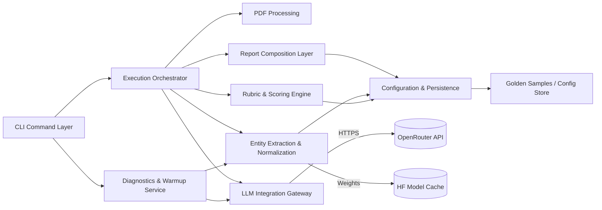

# Components

### CLI Command Layer
**Responsibility:** Typer-based command surface exposing `run` and `warm-up` subcommands, parsing CLI flags (quiet, wide, model options), validating inputs, and handing off execution while ensuring quiet runs still emit the final entities section.

**Key Interfaces:**
- `run(resume_path, jd_path, **options)`
- `warm_up(**options)`

**Dependencies:** Execution Orchestrator; Diagnostics & Warmup Service; Configuration & Persistence.

**Technology Stack:** `typer` 0.12.3 on top of `click` 8.1.7 with stdlib logging and quiet-aware logging configuration.

### Execution Orchestrator
**Responsibility:** Central controller for end-to-end processing—stitches together parsing, extraction, scoring, LLM call, and reporting within a deterministic pipeline.

**Key Interfaces:**
- `execute(run_context: EvaluationRun) -> ReportEnvelope`
- `handle_failure(error) -> int`

**Dependencies:** PDF Processing; Language Detection & Localization; Entity Extraction & Normalization; Rubric & Scoring Engine; LLM Integration Gateway; Report Composition Layer; Diagnostics hooks.

**Technology Stack:** Python service class with dependency injection, `tenacity` for retries, structured logging adapters.

### PDF Processing Module
**Responsibility:** Safely extract, clean, and normalize text from resume PDFs while logging recoverable parsing issues.

**Key Interfaces:**
- `extract_text(resume_path) -> str`
- `inspect_metadata(resume_path) -> Dict[str, Any]`

**Dependencies:** `pypdf`; logging; configuration for language detection hints.

**Technology Stack:** Functional wrapper around `pypdf` 5.1.0 with heuristics for malformed PDFs.

### Language Detection & Localization
**Responsibility:** Resolve the effective locale for prompts and report sections using defaults (`es-MX`), CLI overrides, and automatic detection from resume/JD content.

**Key Interfaces:**
- `detect(profile_inputs) -> LanguageProfile`
- `enforce_override(lang_code, profile) -> LanguageProfile`

**Dependencies:** `langdetect`; configuration defaults; access to ResumeDocument/JobDescription text; logging.

**Technology Stack:** langdetect tuned to prioritize Spanish confidence; fallback heuristics when detection is ambiguous; integrates with `utils/language.py` helpers.
### Entity Extraction & Normalization Module
**Responsibility:** Run the HuggingFace NER pipeline, emit EntityOccurrence records with document context, normalize canonical entities per FR13, and persist transformation logs.

**Key Interfaces:**
- `extract_entities(text, lang) -> ExtractedEntityCollection`
- `warm_cache(model_id)`

**Dependencies:** `transformers`, `tokenizers`, AliasMap, CPU-optimized settings.

**Technology Stack:** Transformers pipeline with thread-safe model loading, locale-aware alias application, and shared helpers for context snippet extraction.

### Rubric & Scoring Engine
**Responsibility:** Apply rubric weights/thresholds to normalized entities and job description context to compute deterministic sub-scores and totals.

**Key Interfaces:**
- `compute_scorecard(entities, job_desc, rubric) -> RubricScorecard`
- `explain(scorecard) -> Dict[str, str]`

**Dependencies:** RubricConfig; job description utilities; statistics helpers.

**Technology Stack:** Pydantic-backed config objects, numeric operations via Python `decimal`.

### LLM Integration Gateway
**Responsibility:** Encapsulate OpenRouter HTTP calls, request shaping, retries, and fallbacks/mock responses for offline mode.

**Key Interfaces:**
- `invoke(prompt, params) -> LLMAnalysis`
- `health_check() -> WarmupCheckResult`

**Dependencies:** `httpx`, `tenacity`, environment loader for `OPENROUTER_API_KEY`.

**Technology Stack:** Async-capable `httpx` client used synchronously; structured timeout/retry policies.

### Report Composition Layer
**Responsibility:** Merge rubric metrics, LLM insights, and canonical entities into terminal-ready sections, ensuring quiet runs still emit the final entities summary and `--wide` expands tables with document sources while maintaining ASCII formatting.

**Key Interfaces:**
- `build_envelope(scorecard, llm_analysis, entities) -> ReportEnvelope`
- `render(envelope, stream) -> None`

**Dependencies:** `rich`; localization helpers; text wrapping utilities.

**Technology Stack:** Rich console with fallback plain formatter for quiet mode, width-aware helpers, and localization utilities shared with EvaluationRun.

### Diagnostics & Warmup Service
**Responsibility:** Execute optional warm-up command: prefetch models, verify API connectivity, report readiness status before demos.

**Key Interfaces:**
- `run_checks(options) -> WarmupResult`
- `summarize(result) -> str`

**Dependencies:** Language Detection & Localization; Entity Extraction module; LLM gateway; filesystem for cache; logging.

**Technology Stack:** Shared service invoked via Typer subcommand with `rich` progress.

### Configuration & Persistence Layer
**Responsibility:** Load rubric/alias configs, manage model cache paths, persist golden samples and run metadata for FR12 verification.

**Key Interfaces:**
- `load_rubric(version) -> RubricConfig`
- `load_alias_map() -> AliasMap`
- `persist_run(run: EvaluationRun)`

**Dependencies:** `PyYAML`; filesystem; Pydantic models.

**Technology Stack:** Config readers/writers with Windows-aware paths.

### Component Diagram

