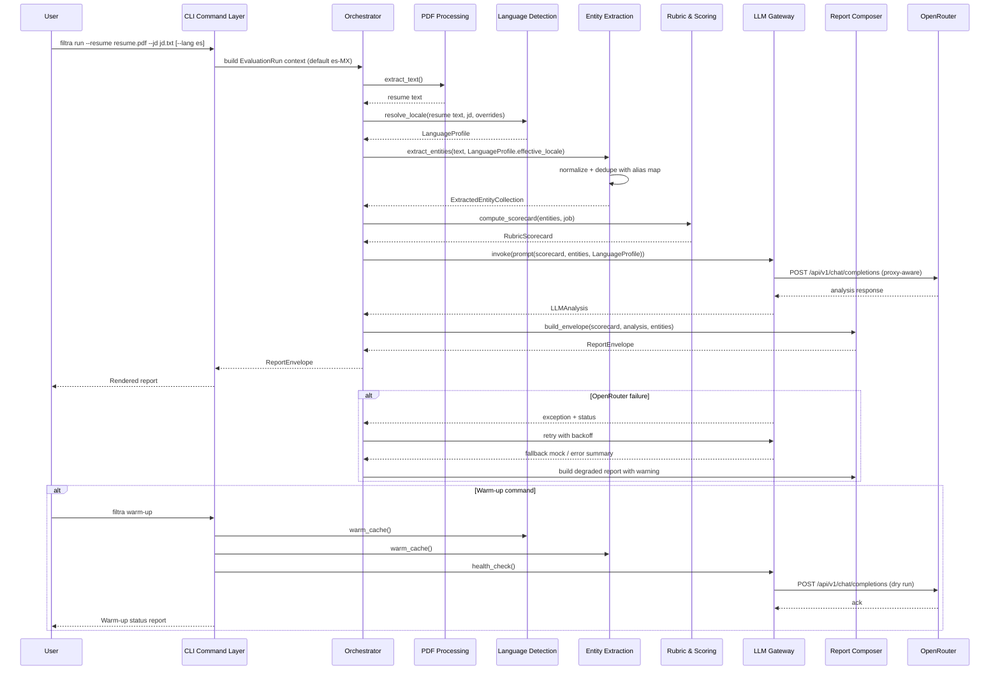

# Core Workflows

```mermaid
sequenceDiagram
    participant User
    participant CLI as CLI Command Layer
    participant Orchestrator
    participant PDF as PDF Processing
    participant Lang as Language Detection
    participant NER as Entity Extraction
    participant Rubric as Rubric & Scoring
    participant LLM as LLM Gateway
    participant Report as Report Composer
    participant OpenRouter

    User->>CLI: filtra run --resume resume.pdf --jd jd.txt [--lang es]
    CLI->>Orchestrator: build EvaluationRun context (default es-MX)
    Orchestrator->>PDF: extract_text()
    PDF-->>Orchestrator: resume text
    Orchestrator->>Lang: resolve_locale(resume text, jd, overrides)
    Lang-->>Orchestrator: LanguageProfile
    Orchestrator->>NER: extract_entities(text, LanguageProfile.effective_locale)
    NER->>NER: normalize + dedupe with alias map
    NER-->>Orchestrator: ExtractedEntityCollection
    Orchestrator->>Rubric: compute_scorecard(entities, job)
    Rubric-->>Orchestrator: RubricScorecard
    Orchestrator->>LLM: invoke(prompt(scorecard, entities, LanguageProfile))
    LLM->>OpenRouter: POST /api/v1/chat/completions (proxy-aware)
    OpenRouter-->>LLM: analysis response
    LLM-->>Orchestrator: LLMAnalysis
    Orchestrator->>Report: build_envelope(scorecard, analysis, entities)
    Report-->>Orchestrator: ReportEnvelope
    Orchestrator-->>CLI: ReportEnvelope
    CLI-->>User: Rendered report

    alt OpenRouter failure
        LLM-->>Orchestrator: exception + status
        Orchestrator->>LLM: retry with backoff
        LLM-->>Orchestrator: fallback mock / error summary
        Orchestrator->>Report: build degraded report with warning
    end

    alt Warm-up command
        User->>CLI: filtra warm-up
        CLI->>Lang: warm_cache()
        CLI->>NER: warm_cache()
        CLI->>LLM: health_check()
        LLM->>OpenRouter: POST /api/v1/chat/completions (dry run)
        OpenRouter-->>LLM: ack
        CLI-->>User: Warm-up status report
    end
```

